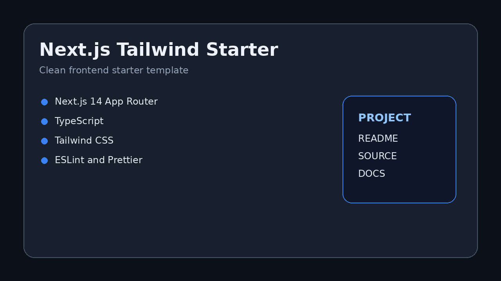
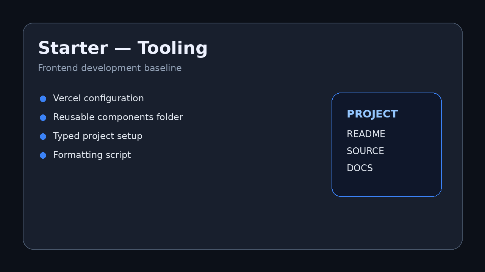
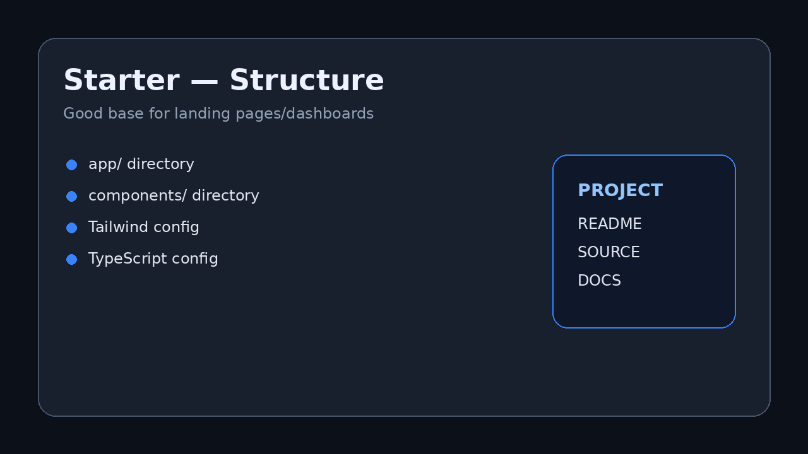

# Next.js Tailwind Starter

## English
Next.js Tailwind Starter is a portfolio/demo project kept public to show project structure, tooling, and implementation approach. It includes real source files and is documented as a practical learning/portfolio repository.

### Highlights
- Clear project structure.
- Source code organized by module.
- Development-oriented configuration.
- README and screenshots included for quick review.

### Screenshots

## Русский
Next.js Tailwind Starter — portfolio/demo-проект, оставленный публичным для демонстрации структуры, tooling и подхода к реализации. Репозиторий содержит реальный исходный код и оформлен как практический учебный/портфолио-проект.

### Главное
- Понятная структура проекта.
- Код разделён по модулям.
- Конфигурация для разработки.
- README и скриншоты для быстрого просмотра.

### Скриншоты

## Українська
Next.js Tailwind Starter — portfolio/demo-проєкт, залишений публічним для демонстрації структури, tooling та підходу до реалізації. Репозиторій містить реальний вихідний код і оформлений як практичний навчальний/портфоліо-проєкт.

### Головне
- Зрозуміла структура проєкту.
- Код розділений за модулями.
- Конфігурація для розробки.
- README та скріншоти для швидкого перегляду.

### Скріншоти

